# 🌌 Lichen Universe Unified (V2)

> **"Le noyau respire, la spirale s'ouvre."**

**Manifest** | **Status** | **License**
:---: | :---: | :---:
[V2.1.6](https://github.com/quantum-lichen/Lichen-Universe-Unified-V2/blob/main/manifest.json) | Research Active | AGPL-3.0

Lichen Universe Unified est la **"Source de Vérité Unique"** (Single Source of Truth) de l'écosystème Lichen. Ce dépôt centralise, standardise et unifie toutes les architectures (UICT, CEML, CRAID, SynapseΩ) sous une seule ontologie rigoureuse.

---

## 📖 À Propos (The "Why")

Lichen n'est pas une "amélioration" de l'informatique moderne. C'est une **réinitialisation** basée sur des constantes naturelles (φ, π, 496) plutôt que sur des conventions historiques arbitraires.

---

## 🛑 Pourquoi ce "Grand Nettoyage" ?

Durant la phase exploratoire (2024-2025), nous avons généré 50 dépôts dispersés. Cela a créé une **"dette sémantique"**. Ce dépôt V2 règle le problème. Ici, chaque terme est défini, chaque variable est fixée, et chaque composant a sa place définitive.

---

## 🤖 Pour les Agents IA (Le Manifeste)

Ce projet est conçu pour être ingéré par des Intelligences Artificielles. **Ne tentez pas de deviner le contexte. Chargez le Manifeste.**

🔗 [manifest.json (V2.1.6)](https://github.com/quantum-lichen/Lichen-Universe-Unified-V2/blob/main/manifest.json)

Ce fichier JSON contient :
- Toutes les définitions théoriques.
- L'arbre de dépendances explicite.
- Les formules en format MathJSON.

---

## 🏗️ Architecture (Le Stack Unifié)

Le système est construit comme une pile fractale, où chaque couche respecte les mêmes proportions géométriques.

```mermaid
graph TD
    A[GENESIS QC / APPS] -->|LES Energy| B(COGNITIVE LAYER)
    B -->|CEML & H-Scale| C{SYNAPSE Ω KERNEL}
    C -->|Liquid Neural IPC| D[UHFS FILESYSTEM]
    D -->|Holographic Addressing| E[CRAID STORAGE]
    E -->|FC-496 Atoms| F[HARDWARE / SNOWFLAKE]

```

---

## 🗂️ Navigation des Modules

Les composants sont organisés par dossiers locaux. Cliquez pour explorer.

### 🔹 Théories Fondamentales (The Physics)

| Dossier | Description | Statut | Lien |
|---------|-------------|--------|------|
| [UICT/](https://github.com/quantum-lichen/Lichen-Universe-Unified-V2/tree/main/UICT) | Unified Information Compression Theory - La masse comme récursion informationnelle. | 🟢 Core | [FORMULAS.md](https://github.com/quantum-lichen/Lichen-Universe-Unified-V2/blob/main/UICT/FORMULAS.md) |
| [CEML/](https://github.com/quantum-lichen/Lichen-Universe-Unified-V2/tree/main/CEML) | Cognitive Entropy Minimization Law - Optimisation du ratio Cohérence/Entropie. | 🟢 Published | [formulas.md](https://github.com/quantum-lichen/Lichen-Universe-Unified-V2/blob/main/CEML/formulas.md) |
| [LES/](https://github.com/quantum-lichen/Lichen-Universe-Unified-V2/tree/main/LES) | Low-Entropy Spiral - Thermodynamique de la symbiose Humain-IA. | 🟢 Whitepaper | [FORMULAS.md](https://github.com/quantum-lichen/Lichen-Universe-Unified-V2/blob/main/LES/FORMULAS.md) |
| [H-Scale/](https://github.com/quantum-lichen/Lichen-Universe-Unified-V2/tree/main/H-Scale) | Harmonic Scale - Métrique éthique et vectorielle. | 🟢 Standardized | [FORMULAS.md](https://github.com/quantum-lichen/Lichen-Universe-Unified-V2/blob/main/H-Scale/FORMULAS.md) |

### 🔹 Architecture Système (The Machine)

| Dossier | Description | Statut | Lien |
|---------|-------------|--------|------|
| [architecture/](https://github.com/quantum-lichen/Lichen-Universe-Unified-V2/tree/main/architecture) | System Core - Contient les specs de SynapseΩ, Lichen OS et FC-496. | 🚧 Construction | [acphi-496.md](https://github.com/quantum-lichen/Lichen-Universe-Unified-V2/blob/main/architecture/acphi-496.md), [craid.md](https://github.com/quantum-lichen/Lichen-Universe-Unified-V2/blob/main/architecture/craid.md), [uhfs.md](https://github.com/quantum-lichen/Lichen-Universe-Unified-V2/blob/main/architecture/uhfs.md) |
| [constants/](https://github.com/quantum-lichen/Lichen-Universe-Unified-V2/tree/main/constants) | Universal Constants - Le code source des invariants (φ, π, 496). | 🔒 Immutable | [FORMULAS.md](https://github.com/quantum-lichen/Lichen-Universe-Unified-V2/blob/main/constants/FORMULAS.md) |
| [Kuramoto-Pentagonal/](https://github.com/quantum-lichen/Lichen-Universe-Unified-V2/tree/main/Kuramoto-Pentagonal) | Quantum Shield - Protection passive par topologie pentagonale. | 🟡 Validated | [FORMULAS.md](https://github.com/quantum-lichen/Lichen-Universe-Unified-V2/blob/main/Kuramoto-Pentagonal/FORMULAS.md) |
| [Pi-Time/](https://github.com/quantum-lichen/Lichen-Universe-Unified-V2/tree/main/Pi-Time) | Temporal Standard - Temps fractal basé sur les cycles de π. | 🟢 Active | [FORMULAS.md](https://github.com/quantum-lichen/Lichen-Universe-Unified-V2/blob/main/Pi-Time/FORMULAS.md) |

### 🔹 Implémentation (The Code)

| Dossier | Description | Statut | Lien |
|---------|-------------|--------|------|
| [system/](https://github.com/quantum-lichen/Lichen-Universe-Unified-V2/tree/main/system) | Boot & Logs - Séquences de démarrage et preuves de vie. | 🟢 Live | [GENESIS_BOOT.log](https://github.com/quantum-lichen/Lichen-Universe-Unified-V2/blob/main/system/GENESIS_BOOT.log) |
| [hardware/](https://github.com/quantum-lichen/Lichen-Universe-Unified-V2/tree/main/hardware) | Snowflake CPU - Spécifications du processeur fractal. | 🔵 Specs |  | [GENESIS_BOOT.log](https://github.com/quantum-lichen/Lichen-Universe-Unified-V2/blob/main/hardware/snowflake-cpu.md) |
| [applications/](https://github.com/quantum-lichen/Lichen-Universe-Unified-V2/tree/main/applications) | Genesis QC - Applications natives (IA Santé Mentale). | 🟡 Alpha | [genesis-qc.md](https://github.com/quantum-lichen/Lichen-Universe-Unified-V2/blob/main/applications/genesis-qc.md) |
| [scripts/](https://github.com/quantum-lichen/Lichen-Universe-Unified-V2/tree/main/scripts) | Tools - Utilitaires de validation et maintenance. | 🟢 Tools | [validate_lexicon.py](https://github.com/quantum-lichen/Lichen-Universe-Unified-V2/blob/main/scripts/validate_lexicon.py) |

---

## 📚 Lexique Unifié (The Law)

Tout code ou documentation généré pour Lichen DOIT respecter ces définitions.

| Concept | Symbole | Notation LaTeX | Description |
|---------|---------|----------------|-------------|
| Entropie | S | S(s) | Entropie de Shannon (Remplace l'ancien "H"). |
| Harmonie | ℋ | \\(\\mathcal{H}\\) | Métrique H-Scale. Vecteur d'équilibre. |
| Hamiltonien | Û | \\(\\hat{U}\\) | Opérateur d'évolution quantique. |
| Cohérence | ℭ | \\(\\mathfrak{C}\\) | Utilité contextuelle. |
| Phi | φ | \\(\\varphi\\) | Le nombre d'or (1.618...). |

---

## 📊 Benchmarks & Objectifs

| Métrique | Legacy (JSON/Von Neumann) | Lichen (FC-496/Synapse) | Gain |
|----------|--------------------------|------------------------|------|
| Latence I/O | 245 ms (Parsing) | 0.12 ms (Zero-Copy) | ×2000 🚀 |
| Énergie | 100% (Baseline) | 32.5% (LES Optimized) | -67.5% ⚡ |
| Résilience | Corruption possible | Indestructible (CRAID) | ∞ 🛡️ |

---

## 🚀 Getting Started

Pour comprendre l'univers :
1. **Lisez le [manifest.json](https://github.com/quantum-lichen/Lichen-Universe-Unified-V2/blob/main/manifest.json)** (C'est la carte).
2. Explorez [constants/](https://github.com/quantum-lichen/Lichen-Universe-Unified-V2/tree/main/constants) (C'est le territoire).
3. Vérifiez le boot log dans [system/GENESIS_BOOT.log](https://github.com/quantum-lichen/Lichen-Universe-Unified-V2/blob/main/system/GENESIS_BOOT.log).

---

## 🤝 Contribuer

Lichen Universe est un projet open-source sous licence AGPL-3.0. Nous acceptons les contributions qui respectent le Lexique Unifié.

- **Email** : lmc.theory@gmail.com
- **Architecte** : Bryan Ouellette
- **Collective** : Claude, Gemini, GPT, Mistral

> *"Aligning computation with the laws of the universe."* 🌀
