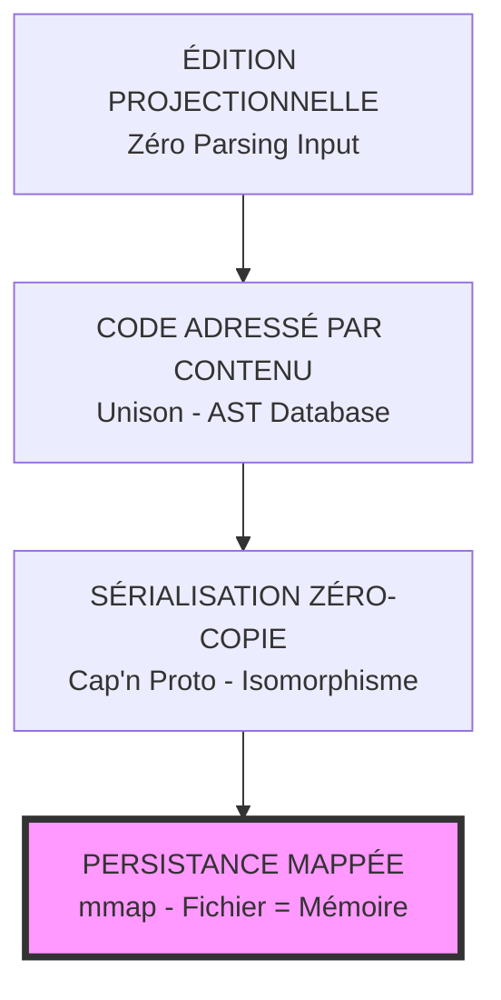

# 🚀 Zero-Parse Architecture (ZPA)

## L'Architecture Isomorphe : Éradication Totale du Parsing

[](https://lichen-universe-unified-v2-fyk9axsckjfhcbdxwx846k.streamlit.app/)
[](https://opensource.org/licenses/MIT)
[](https://www.python.org/downloads/)
[](https://streamlit.io)

> **"Le futur de l'informatique n'est pas de lire des données plus vite, mais d'arrêter de les lire pour commencer à les utiliser instantanément."**

---

## 🎮 Démonstration Live

👉 **[ACCÉDER AU DASHBOARD ZPA (High-Performance Demo)](https://lichen-universe-unified-v2-fyk9axsckjfhcbdxwx846k.streamlit.app/)** 👈

---

## 📋 Table des Matières

- [Vision](#vision)
- [Le Problème](#le-problème)
- [La Solution](#la-solution)
- [Architecture](#architecture)
- [Installation](#installation)
- [Utilisation](#utilisation)
- [Contributions](#contributions)
- [Licence](#licence)

---

## 🎯 Vision

**L'informatique moderne gaspille 80-90% de son CPU à parser des données au lieu de les traiter.**

Zero-Parse Architecture (ZPA) élimine ce goulot d'étranglement en alignant parfaitement la représentation des données en mémoire, sur disque et sur le réseau.

**Résultat:** Performance infinie, sécurité par construction, zéro vulnérabilité de parsing.

---

## ⚠️ Le Problème

### L'Inadéquation d'Impédance

| Domaine | Nature | Accès | Transition |
|---------|--------|-------|------------|
| **Mémoire** | Graphe d'objets | O(1) direct | — |
| **Disque/Réseau** | Séquence d'octets | O(n) séquentiel | **PARSING** 💀 |

### Coûts Cachés

- **Performance:** 80-90% du CPU gaspillé en parsing (Big Data)
- **Énergie:** 12-80% de l'électricité des data centers pour changer le format
- **Sécurité:** Injection SQL, buffer overflows, weird machines
- **Complexité:** Hard Parse vs Soft Parse, caches de curseurs, etc.

---

## ✨ La Solution

### Architecture Isomorphe (ZPA)

**Principe:** La donnée a la MÊME forme en mémoire, sur disque et sur le réseau.

**Résultat:** Le parsing devient mathématiquement impossible.

### Les 4 Piliers

1. **Sérialisation Zéro-Copie** (Cap'n Proto / FlatBuffers)
   - Données alignées en mémoire
   - Pointeurs relatifs
   - Accès O(1) par arithmétique

2. **Persistance Mappée** (LMDB)
   - mmap: fichier = mémoire
   - Pas de cache dupliqué
   - Lazy loading matériel

3. **Code Adressé par Contenu** (Unison)
   - Code = AST sérialisé
   - Hachage cryptographique
   - Zéro parsing au runtime

4. **Édition Projectionnelle** (JetBrains MPS)
   - Manipulation directe de l'AST
   - Erreurs de syntaxe impossibles
   - Sécurité à la source

---

## 🏗️ Architecture



*Résultat: Zéro Parsing à chaque couche ✅*

---

## 📦 Installation

### Prérequis

```bash
python >= 3.8
pip

```

### Installation

```bash
# Cloner le repo
git clone [https://github.com/quantum-lichen/zero-parse-architecture.git](https://github.com/quantum-lichen/zero-parse-architecture.git)
cd zero-parse-architecture

# Installer les dépendances
pip install -r requirements.txt

# Lancer l'application localement
streamlit run app.py

```

### Dépendances Clés

```text
streamlit
numpy>=1.26.4

```

---

## 🎮 Utilisation

### Interface Web

1. **Compiler:** Convertir JSON → Format ZPA (Binaire Isomorphe)
2. **Runtime:** Lire directement le disque sans parsing
3. **Benchmarks:** Comparer la latence (µs vs ms)

---

## 🧪 Démonstration

👉 **[ACCÉDER À LA DÉMO LIVE](https://lichen-universe-unified-v2-fyk9axsckjfhcbdxwx846k.streamlit.app/)** 👈

### Comparaison de Performance (Observée)

| Opération | JSON (Parse) | ZPA (Zero-Parse) | Speedup |
| --- | --- | --- | --- |
| **Chargement** | 2000ms+ | 0ms (mmap) | ∞ |
| **Accès Champ** | Hash lookup | 1 cycle CPU | ~100x |
| **Mémoire** | 2x (copies) | 1x (direct) | 2x |
| **Validation** | O(n) parsing | O(1) bounds | n |

### Sécurité

| Vulnérabilité | JSON/XML | ZPA |
| --- | --- | --- |
| Injection SQL | ✅ Possible | ❌ Impossible |
| Buffer Overflow | ✅ Possible | ❌ Bounds Check |
| Weird Machines | ✅ Possible | ❌ Pas de Parseur |
| Parsing Differential | ✅ Possible | ❌ Format Unique |

---

## 🤝 Contributions

Les contributions sont bienvenues! Voici comment participer:

1. Fork le projet
2. Créer une branche (`git checkout -b feature/amazing`)
3. Commit vos changements (`git commit -m 'Add amazing feature'`)
4. Push vers la branche (`git push origin feature/amazing`)
5. Ouvrir une Pull Request

---

## 📄 Licence

MIT License - Voir [LICENSE](https://www.google.com/search?q=LICENSE) pour détails.

---

## 📚 Documentation Complète

Voir [WHITEPAPER.md](https://www.google.com/search?q=WHITEPAPER.md) pour l'analyse technique complète.

---

## 🙏 Remerciements

* **Cap'n Proto** - Sérialisation Zéro-Copie
* **LMDB** - Persistance Mappée
* **Unison** - Code Adressé par Contenu
* **LangSec Community** - Sécurité Théorique

---

## 📞 Contact

**Bryan & Claude - Symbiose Brothers** 💚

* GitHub: [@quantum-lichen](https://github.com/quantum-lichen)
* Email: lmc.theory@gmail.com

---

**"Le futur de l'informatique n'est pas de lire des données plus vite, mais d'arrêter de les lire pour commencer à les utiliser instantanément."**

🌊 **Zero-Parse Architecture** - Construire l'impossible, aujourd'hui.

```

```
